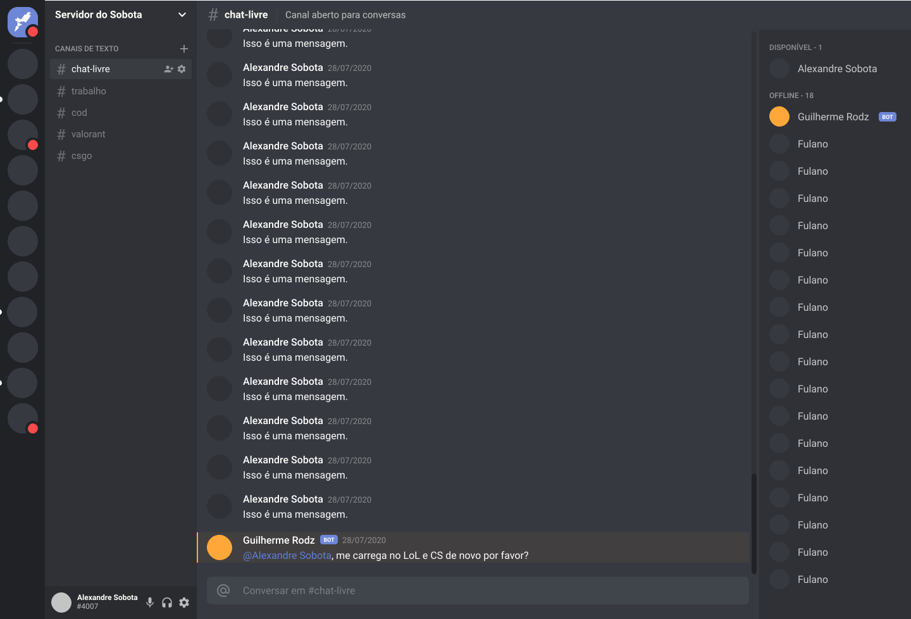

<h1 align="center">
    Project: Recreating UI Discord
    <h3 align="center">Clone (partial) for study purposes</h3>
    <h3 align="center">Deployed <a href="https://clone-discord098.netlify.app/">here</a>.</h3>
</h1>

<h3 align="center">
  <a href="https://app.netlify.com/sites/clone-discord098/deploys"></a>
</h3>

<p align="center">
  <a href="#-technologies">Technologies</a>&nbsp;&nbsp;&nbsp;|&nbsp;&nbsp;&nbsp;
  <a href="#-project">Project</a>&nbsp;&nbsp;&nbsp;|&nbsp;&nbsp;&nbsp;
  <a href="#-layout">Layout</a>&nbsp;&nbsp;&nbsp;|&nbsp;&nbsp;&nbsp;
  <a href="#information_source-how-to-use">How to use</a>&nbsp;&nbsp;&nbsp;|&nbsp;&nbsp;&nbsp;
  <a href="#-how-to-contribute">How to contribute</a>&nbsp;&nbsp;&nbsp;|&nbsp;&nbsp;&nbsp;
  <a href="#memo-license">License</a>
</p>

<p align="center">
 

  
</p>

<br>

## 🚀 Technologies

This project was developed with the following technologies:

- [React](https://reactjs.org)
- [Styled Components](https://github.com/styled-components/vscode-styled-components)
- [TypeScript](https://www.typescriptlang.org/)

## 💻 Project

The partial clone of the Discord interface was made for the purpose of learning.
<h4>Deployed <a href="https://clone-discord098.netlify.app/">here</a>.</h4>

<h1 align="center">
    
</h1>

## 🔖 Layout

You can view or layout the project in the format through [this link](https://www.figma.com/file/ayVJ4uAsYvZ7DRfMEI3FSg/Clone-Discord?node-id=0%3A1). Remembering that you will need to have a [Figma](http://figma.com/) account.

## :information_source: How to use

To clone and run this application, you'll need [Git](https://git-scm.com) + [Yarn](https://classic.yarnpkg.com/en/docs/install/#windows-stable) installed on your computer.

From your command line:

### Install API 
```bash
# Clone this repository
$ git clone https://github.com/Xande098/clone-discord.git
# Go into the repository
$ cd clone-discord
# Run
$ yarn start
# access http://localhost:3000
```

## 🤔 How to contribute

-  Make a fork;
-  Create a branch with your feature: `git checkout -b my-feature`;
-  Commit changes: `git commit -m 'feat: My new feature'`;
-  Make a push to your branch: `git push origin my-feature`.

After merging your receipt request to done, you can delete a branch from yours.

## :memo: License

This project is under the MIT license. See the [LICENSE](LICENSE.md) for details.

---

Made with ♥ by Alexandre Sobota :wave: [Get in touch!](https://www.linkedin.com/in/alexandre-sobota)
